# JPEGをJavaScriptで自力デコードする

## 概要

この記事では静止画像のデータ圧縮のフォーマットの一つであるJPEGの仕様書 ([ITU T.81]((https://www.w3.org/Graphics/JPEG/itu-t81.pdf))) を参考にその論理やアルゴリズム、そしてそのデータ構造をなるだけ噛み砕いて解説していきたいと思います。

またサンプルプログラムとして**JavaScriptを用いつつも標準APIや外部ライブラリに頼ることなくJPEGをデコードするプログラム**を用意していますのでそちらを用いた具体的な実装にに関しても解説を行います。

解説の内容に関しましてはデコード処理が中心となっております。これはエンコーダと比べデコーダを用意仕様と考えた際に様々なデータ構成のJPEGに対応するためにより深く仕様を理解する必要がありより有意義に仕様を学べるのではないかと考え、デコーダを中心とした解説としました。

また、これを読んで仕様を一通り理解出来たのであればエンコーダをより容易に作成出来ると考えています。

### JPEGの概要

まずJPEGの概要に関して軽くおさらいしたい思います。JPEGは世界中で広く普及している静止画像のデータ圧縮フォーマットとなります。**JPEGはJoint Photographic Experts Group (該標準作成機関)** の頭文字を取ったものとなります。

このJPEGは国際標準化機構 (ISO: International Organization for Standardization) 、国際電気標準会議 (IEC: International Electrotechnical Commission) 、国際電気通信連盟 (ITU: International Telecommunication Union) 等の団体にて規格化されています。

このJPEGには人間の生理的な特性を利用して人の目には見えにくい情報を意図的に削り圧縮前のデータに完全に戻らないものの圧縮率を上げる **非可逆圧縮** と、あまり知られてないのですが圧縮前のデータに完全に戻する事が出来る **可逆圧縮** の2つのモードがサポートされています。

非可逆圧縮で主に使用されている技術としては色情報の間引き、高周波数成分の間引きとこちらは非可逆圧縮と可逆圧縮共通となりますがエントロピー符号化によりデータ容量の削除を行っています。

これらの技術を利用しデータ圧縮を行うことで未圧縮の画像データと比べ概ね1/8程度にデータの圧縮を行うことが出来ます。

### この記事での目標

この記事では読まれる方々が次の事が出来るようになる事を目標として掲げ記事を構成しています。

- JPEGの基本的な論理やアルゴリズム、データ構造を理解すること。
- JavaScriptを用いた実装の解説を元に自らも任意のプログラミング言語を用い、標準APIや外部ライブラリに頼ることなくJPEGのデコーダの実装を行えるようになること。

### お品書き

この記事で解説する内容は下記の一覧となります。

- 論理、アルゴリズム
  - エンコード、デコードの流れ
  - 色空間変換
  - 画像分割
  - 周波数変換
  - 量子化
  - 直流差分変換
  - データの転送方法
- データ構造、処理
  - セグメント
  - 量子化テーブル
  - ハフマンテーブル
  - ビットストリーム
  - ハフマン符号化

また、この記事では下記の仕様に関しては解説をスキップします。

- 可逆圧縮
  - 差分パルス符号変調とエントロピー符号化のこの2つの仕組みによる簡易的な圧縮方法であり一般的なJPEGの高度なデータの圧縮、転送の仕組みと異なるため
- 算術符号化
  - 過去の特許問題と処理速度の問題によりハフマン符号化が標準となっており算術演算による符号化はほとんど使用されていないため

## 論理、アルゴリズム

この章ではJPEGのエンコーダ、デコーダの具体的な実装というよりかは実装に至る前のJPEGで使用されている論理やアルゴリズムの概要に関して説明を行います。

### JPEGのエンコード、デコードの流れ

JPEGのエンコードとデコードの大まかな流れを説明します。

まずエンコードは画像全体に対しユニットと呼ばれる8️×8の処理単位に画像を分割します。そして、その分割された画像それぞれに対し、色空間変換 (RGBからYCbCrへの変換) 、周波数変換 (離散コサイン変換) 、量子化と前処理を行い、それらのデータに対しエントロピー符号化 (ハフマン符号化) を行いデータ化を行います。

そして次にデコードのはデータに対しエントロピー復号化 (ハフマン復号化) を行い、それらのデータ対し、再量子化、周波数変換 (逆離散コサイン変換) 、色空間変換 (YCbCrからRGBへの変換) を行い分割された画像を結合して1枚の画像に戻します。

#### エンコード

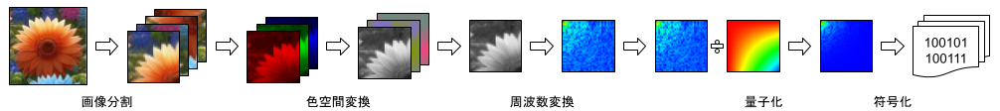

1. 色空間変換 (RGBからYCbCrへの変換)
1. 画像分割
1. 周波数解析 (離散コサイン変換)
1. 量子化
1. エントロピー符号化 (ハフマン符号化)

#### デコード

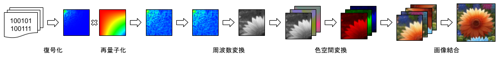

1. エントロピー復号化 (ハフマン復号化)
1. 再量子化
1. 周波数解析 (逆離散コサイン変換)
1. 画像結合
1. 色空間変換 (YCbCrからRGBへの変換)

### 色空間変換

コンピューター上で色情報を取り扱う場合、光の三原色と呼ばれている赤 (R) 、緑 (G) 、青 (B) の3色を任意の割合で加算合成する事により任意の色を表現する事が出来ます。これをRGBカラーモデルといいます。またPhotoshop等の印刷物を前提として色情報を取り扱う場合はシアン (C) 、マゼンタ (M) 、イエロー (Y) 、ブラック (K) の4色を任意の割合で減算合成することで任意の色を表現する事が出来ます。これをCMYKカラーモデルといいます。


JPEGではこれらの形式とは異なるカラーモデルが使用されています。JPEGではYCbCrと呼ばれるカラーモデルが使用されていて輝度 (Y) 、青から輝度をを差し引いた値 (B - Y) に定数を掛けた値 (Cb) 、赤から輝度を差し引いた値 (R - Y) に定数を掛けた値 (Cr) のこれらの値の座標により任意の色を表現するカラーモデルが採用されています。

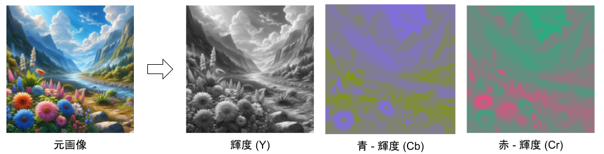

JPEGでは何故、YCbCrのカラーモデルが採用されているかというと人の目には輝度 (Y) の変化には敏感で色彩 (CbCr) の変化には鈍感という特性があります。詳しい仕組みに関しては後で解説しますが、これを利用して色彩の解像度を落としたり (色情報の間引き) を行ったり、色彩の高周波数領域の情報を量子化により輝度よりも大幅に削ったりすることで圧縮率を上げることが出来るため、このカラーモデルが採用されています。

コンピューター上で使用される画像データのカラーモデルは概ねRGBカラーモデルで取り扱われているので下記の数式を使用してRGBとYCbCrの相互変換を行えます。

RGBからYCbCrに変換

```math
\begin{aligned}
Y &= 0.299 R + 0.587 G + 0.114 B \\
Cb &= - 0.1687 R - 0.3313 G + 0.5 B + 128 \\
Cr &= 0.5 R - 0.4187 G - 0.0813 B + 128
\end{aligned}
```

```JavaScript
function rgbToYcbcr(dst, dstOff, src, srcOff) {
    let r = src[srcOff];
    let g = src[srcOff + 1];
    let b = src[srcOff + 2];
    dst[dstOff] = 0.299 * r + 0.587 * g + 0.114 * b; // Y
    dst[dstOff + 1] = -0.1687 * r - 0.3313 * g + 0.5 * b + 128; // Cb
    dst[dstOff + 2] = 0.5 * r - 0.4187 * g - 0.0813 * b + 128; // Cr
}
```

YCbCrからRGBに変換

```math
\begin{aligned}
R &= Y + 1.402 (Cr - 128) \\
G &= Y - 0.34414 (Cb - 128) - 0.71414 (Cr - 128) \\
B &= Y + 1.772 (Cb - 128)
\end{aligned}
```

```JavaScript
function ycbcrToRgb(dst, dstOff, src, srcOff) {
    let y = src[srcOff] + 128;
    let cb = src[srcOff + 1] + 128;
    let cr = src[srcOff + 2] + 128;
    dst[dstOff] = y + 1.402 * (cr - 128); // R
    dst[dstOff + 1] = y - 0.34414 * (cb - 128) - 0.71414 * (cr - 128); // G
    dst[dstOff + 2] = y + 1.772 * (cb - 128); // B
}
```

#### 色成分間引きによる容量削減

人の目には輝度 (Y) の変化に敏感で色彩 (CbCr) の変化に鈍感という特性があります。JPEGデータの圧縮率を高めたい場合、この特性を利用する仕組みがJPEGの仕様として用意されています。方法としては一枚の画像は Y, Cb, Cr のそれぞれの色要素の画像に分解する事がわけですがこの色要素の Cb, Cr の解像度を落とすことにより容量を削減する事が出来ます。

具体的な方法としては Cb, Cr の色要素の画像に対し水平方向もしくは垂直方向、または水平方向、垂直方向両方の解像度を1/2に落とし圧縮率を上げることが出来ます。

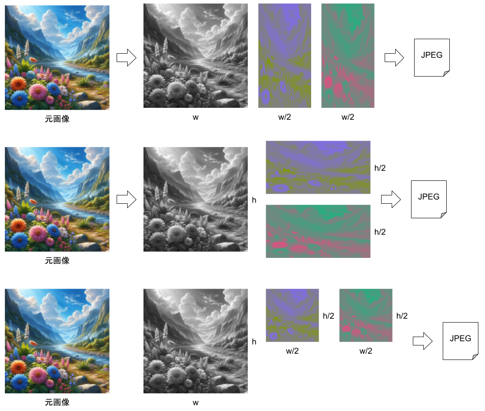

蛇足にはなりますが、この間引き方法にはフォーマットには名前がついています。色の間引きを全く行わないものを4:4:4、色要素の水平方向の解像度を1/2にするものを4:2:2、色要素の水平、垂直方向の両方の解像度を1/2にするものを4:2:0、色要素の水平方向の解像度を1/4にするものを4:1:1と呼びます。

### 画像分割

JPEGではYCbCr形式の画像全体を各色要素ごとに8×8の画像に分割し、それらの分割された画像に対し周波数解析、量子化、エントロピー符号化を行います。この8×8の画像をJEPGではユニットと呼びます。

また画像全体を8×8の正方形に分割するということは画像の縦横のサイズは8の倍数である必要があります。しかし実際に処理する画像が8で割り切れるサイズとは限らないので、その場合は8で割り切れるサイズになるように画像にパディングを加えます。

#### ブロックノイズ

JPEG等の画像圧縮の画像を取り扱うとブロックノイズという単語を耳にしたことがあるかもしれません。このブロックノイズがどういったものかというとJPEGのデータの圧縮率を高めていくと正方形状のグリッド状にノイズが出る現象なのです。

実はこのブロックノイズはこの節で解説したJPEGの画像分割の処理に起因するものであまりにも圧縮率を高めると欠落する情報が多くなりすぎててユニット間の境界付近でノイズが発生してしまう現象になっています。

### 周波数解析

まずは周波数解析とは何かということを解説しなければなりません。周波数解析とは簡単に述べるのであれば世の中のありとあらゆる信号に対して周波数分布を調べるための数学となります。コンピューターでは関連で身近なところでは音声圧縮や画像圧縮、動画圧縮に利用されています。

この周波数解析ですがフーリエ変換を筆頭にコンピュータ上等で離散信号を取り扱うための離散フーリエ変換やJPEGで使用されている離散コサイン変換、ウェーブレット変換、JPEG2000で使用されている離散ウェーブレット変換等があります。

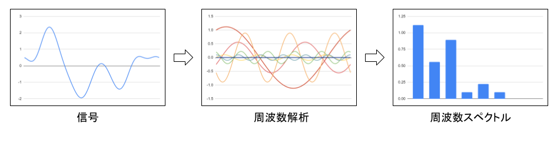

人間の目の特性としては低い周波数の信号に対しては敏感であり高い周波数の信号に対しては鈍感という特性があります。JPEGではこの特性を利用して高い周波数帯の信号に対し量子化により情報量を削ることによりエントロピー符号化によるデータ圧縮効果を高め、圧縮後のデータの圧縮率を上げることが出来ます。

#### 離散コサイン変換

離散コサイン変換とはN個の離散信号を同じくN個の異なる周波数の余弦関数 (cosine) の波に分解する変換となります。この離散コサイン変換にはタイプ1からタイプ8まで定義されており、通常使用されるものはタイプ1からタイプ4となります。(タイプ1, 5はN個の離散信号をN+1の周波数帯に変換)

JPEGではエンコード時の離散信号から周波数領域への変換は離散コサイン変換タイプ2 (DCT-Ⅱ、またはDCT) が使用されデコード時の周波数領域から離散信号への変換には離散コサイン変換タイプ3 (DCT-Ⅲ、または逆DCT) が使用されています。

離散コサイン変換タイプ2 (DCT-Ⅱ、またはDCT)

```math
X_k = \sum_{n=0}^{N-1} x_n cos ( \frac{\pi}{N} (n + \frac{1}{2}) k ) \quad for \quad k = 0, ... N - 1
```

```JavaScript
function dctII(x, N) {
    let X = new Float32Array(N);
    for (let k = 0; k < N; ++k) {
        let sum = 0;
        for (let n = 0; n < N; ++n) {
            sum += x[n] * Math.cos(Math.PI / N * (n + 1 / 2) * k);
        }
        X[k] = sum;
    }
    return X;
}
```

離散コサイン変換タイプ3 (DCT-Ⅲ、または逆DCT)

```math
X_k = \frac{1}{2} x_0 \sum_{n=0}^{N-1} x_n cos (\frac{\pi}{N} (k + \frac{1}{2} n) ) \quad for \quad k = 0, ... N - 1
```

```JavaScript
function dctIII(x, N) {
    let X = new Float32Array(N);
    for (let k = 0; k < N; ++k) {
        let sum = 1 / 2 * x[0];
        for (let n = 1; n < N; ++n) {
            sum += x[n] * Math.cos(Math.PI / N * (k + 1 / 2) * n);
        }
        X[k] = sum;
    }
    return X;
}
```

#### 2次元の離散コサイン変換

全項で解説した離散コサイン変換ですが見ての通り1次元の離散信号を処理するものになっています。しかしJPEGで処理する信号は2次元の画像データでありオリジナルの離散コサイン変換では処理する事が出来ません。そこで、この離散コサイン変換を2次元に拡張する必要があるわけです。

2次元に周波数解析を拡張するということは入力も2次元になるのは当然ですが出力の周波数スペクトルに関しても2次元になります。具体的なデータの構造ですが解析される周波数帯も2次元的になり縦、横の周波数が直行した周波数スペクトルのマトリクスとなります。

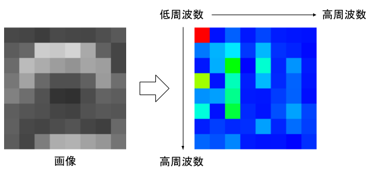

※図の周波数スペクトルの例では赤を大きい値、緑を中くらいの値、青を小さい値で表しています。また実際の値は正数、負数の両方が数値として出ますが便宜上絶対値の大きさで色分けして表しています。

JPEGの仕様書では下記のように定義されておりオリジナルの離散コサイン変換と異なり直交化を確保するため直流成分に対し1/√2を掛けたり変換、逆変換に対し1/4の係数を掛けたりして式を変形することで離散信号 → 周波数スペクトル → 離散信号と変換、逆変換をかけた際にマトリックスの絶対値が変化しないような変換式が定義されています。

2次元拡張型、離散コサイン変換 (変形DCT-Ⅱ)

```math
\begin{aligned}
&S_{vu} = \frac{1}{4} \, C_u \, C_v \, \sum_{x=0}^7 \, \sum_{y=0}^7 \, s_{yx} \, cos \frac{(2x+1)uπ}{16} \, cos \frac{(2y+1)vπ}{16} \\
&\text{where} \\
&C_u, C_v = 1 / \sqrt{2} \quad for \quad u,v = 0 \\
&C_u, C_v = 1 \quad otherwise
\end{aligned}
```

```JavaScript
function dct2D(N, s) {
    const S = new Float32Array(N * N);
    for (let u = 0; u < N; u++) {
        for (let v = 0; v < N; v++) {
            let sum = 0;
            for (let x = 0; x < N; x++) {
                for (let y = 0; y < N; y++) {
                    sum += s[x + N * y] *
                        Math.cos((2 * x + 1) * u * Math.PI / (2 * N)) *
                        Math.cos((2 * y + 1) * v * Math.PI / (2 * N));
                }
            }
            S[u + N * v] = 1 / 4 *
                (u === 0 ? 1 / Math.SQRT2 : 1) *
                (v === 0 ? 1 / Math.SQRT2 : 1) *
                sum;
        }
    }
    return S;
}
```

2次元拡張型、逆離散コサイン変換 (変形DCT-Ⅲ)

```math
\begin{aligned}
&s_{yx} = \frac{1}{4} \, \sum_{u=0}^{7} \, \sum_{v=0}^{7} \, C_u \, C_v S_{vu} \, cos \frac{(2x+1)uπ}{16} \, cos \frac{(2y+1)vπ}{16} \\
&\text{where} \\
&C_u, C_v = 1 / \sqrt{2} \quad for \quad u,v = 0 \\
&C_u, C_v = 1 \quad otherwise
\end{aligned}
```

```JavaScript
function idct2D(N, S) {
    const s = new Float32Array(N * N);
    for (let x = 0; x < N; x++) {
        for (let y = 0; y < N; y++) {
            let sum = 0;
            for (let u = 0; u < N; u++) {
                for (let v = 0; v < N; v++) {
                    sum += (u === 0 ? 1 / Math.SQRT2 : 1) *
                        (v === 0 ? 1 / Math.SQRT2 : 1) *
                        S[u + N * v] *
                        Math.cos((2 * x + 1) * u * Math.PI / (2 * N)) *
                        Math.cos((2 * y + 1) * v * Math.PI / (2 * N));
                }
            }
            s[x + N * y] = 1 / 4 * sum;
        }
    }
    return s;
}
```

#### 離散コサイン変換の高速化

前項で説明した2次元拡張型の離散コサイン変換ですが実は定義されている数式を実直に実装してしまうと要素数Nに対し O (N^4) のオーダーで計算量が必要となります。JPEGでは8×8の非常に小さな要素数ではあるものの、その処理は非常に計算コストがあり低速です。JPEGでは、この離散コサイン変換の処理が全体に対し非常に大きな割合を占めるので高速なアルゴリズムを実装する必要があります。

サンプルプログラムで使用するアルゴリズムとしてはLee型DCT ([A New Algorithm to Compute the
Discrete Cosine Transform - 
BYEONG GI LEE](https://www.nayuki.io/res/fast-discrete-cosine-transform-algorithms/lee-new-algo-discrete-cosine-transform.pdf)) と呼ばれるアルゴリズムを使用しています。

こちらのアルゴリズムの概要を簡単に説明すると前処理、後処理を行うことでN個の要素を持つ離散コサイン変換を2つの1/2個の要素2つの離散コサイン変換に分解する事ができます。この処理を再帰的に行うことで O (N log N) のオーダーで計算量を抑えることが出来ます。こちらのアルゴリズムですが1次元用なので2次元用に拡張する必要があり、拡張すると最終的には O (N^2 log N) のオーダーで計算量が必要になります。結果としては N^4 / (N^2 log N) となり論理値としては概ね20倍ほど高速化を行うことが出来ることになります。

余談にはなりますがサンプルプログラムでは上記の論文の数式に対しアルゴリズム方面で冗長な処理を排除する余地が多分にあり結果としては高速化なしの実装と比べ40倍ほどの高速化を達成しています。

### 量子化

JPEGにおける量子化とは周波数解析により算出された周波数スペクトルに対し圧縮率を上げるための前処理となります。JPEGの仕様に定義されているエントロピー符号化において符号化しようとしている数値の絶対値が小さければ小さいほど圧縮率が向上するという特性があります。そこで量子化ではその周波数スペクトルの数値を小さくするための処理となります。

具体的にはユニットと同サイズの8x8の係数テーブルを用意しエンコード (量子化) 時は周波数スペクトルを量子化テーブルの値を割ります。そしてデコード (再量子化) 時は周波数スペクトルに量子化テーブルの値をかけます。

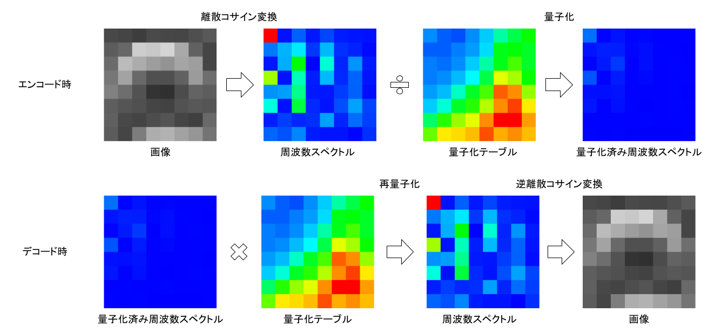

人の目は高周波数の情報には鈍感という特性があるので高周波数領域には特に大きな数値を設定し絶対値を小さくします。さらに色彩に関しては輝度よりもその傾向が大きいのでより中、高周波数に大きな値を設定します。

実際にJPEGのエンコードで使用される量子化テーブルは下記のようになります。

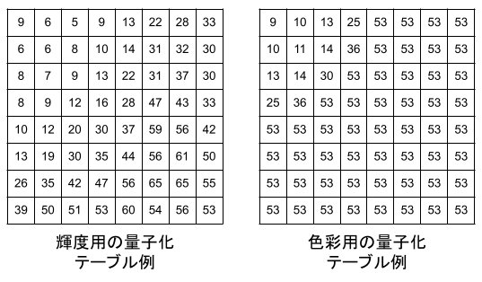

量子化

```math
Sq_{vu} = round \left( \frac{S_{vu}}{Q_{vu}} \right)
```

```JavaScript
quantizedSample[v][u] = Math.round(sample[v][u] / quantizationTable[v][u]);
```

再量子化

```math
R_{vu} = Sq_{vu} × Q_{vu}
```

```JavaScript
sample[v][u] = quantizedSample[v][u] * quantizationTable[v][u];
```

### 直流差分変換

ユニットの周波数スペクトルの中には縦方向にも横方向にも完全に直流の成分があり、こちらの値は他の交流成分とは異なる処理を行います。周波数スペクトルはユニット単位で順々に出力していくのですが直流成分だけは前回の直流成分の値との差分を取りそれをデータの値として出力を行います。

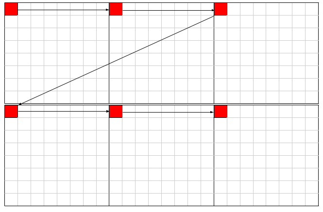

こちらの処理を行う理由は隣り合うユニットの直流成分同士は差分が小さい確率が高く、この処理を行うことでデータ全体の圧縮効率を上げるものとなります。

エンコード時

```math
DIFF = DC_{i} - PRED
```

```JavaScript
diff = sample[0][0] - prev;
prev = sample[0][0];
```

デコード時

```math
DC_{i} = PREV + DIFF
```

```JavaScript
sample[0][0] = prev + diff;
prev = sample[0][0];
```

### データの転送方法

JPEGは1992年に発表された画像フォーマットであり、その当初はインターネットの回線も低速であり画像ですらそのデータ転送にも苦労していた時代でありました。そんな時代背景を反映するようにJPEGには低速の回線上でも画像をネットワーク越しに快適に閲覧出来るようデータ転送の方法にも工夫があり、読み込んだデータを順次レンダリングする手段が用意されています。

#### ジグザグシーケンス

まずは8×8の2次元配列のユニット単体に対しどのような順番でデータを出力するのかを解説します。

データを順次出力しレンダリングを行う関係上、人の目にとって情報の重みが重い低い周波数のデータから情報の重みが軽い高い周波数に向かって順番に出力するために図のようにジグザグにデータの転送を行います。これをJPEGの仕様ではジグザグシーケンスと読んでいます。

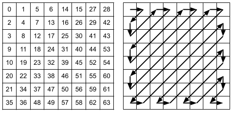

またこのジグザグシーケンスですが量子化によって高周波数領域の絶対値を小さくする関係上、後半に行けば行くほど0が連続したデータが固まる特性上、エントロピー符号化による圧縮率が高くなります。

ジグザグシーケンスの順番の定義

```JavaScript
const zigzagSequenceIndices = [
    0, 1, 5, 6, 14, 15, 27, 28,
    2, 4, 7, 13, 16, 26, 29, 42,
    3, 8, 12, 17, 25, 30, 41, 43,
    9, 11, 18, 24, 31, 40, 44, 53,
    10, 19, 23, 32, 39, 45, 52, 54,
    20, 22, 33, 38, 46, 51, 55, 60,
    21, 34, 37, 47, 50, 56, 59, 61,
    35, 36, 48, 49, 57, 58, 62, 63
];
```

2次元配列からジグザグシーケンスに並べ替え

```JavaScript
function orderZigzagSequence(dst, src) {
    for (let i = 0; i < 64; ++i) {
        dst[zigzagSequenceIndices[i]] = src[i];
    }
}
```

ジグザグシーケンスから2次元配列に戻す

```JavaScript
export function reorderZigzagSequence(dst, src) {
    for (let i = 0; i < 64; ++i) {
        dst[i] = src[zigzagSequenceIndices[i]];
    }
}
```

##### ベースライン

ベースラインは最も基本的なデータの転送方法となり単純に左上から右に向かって順次データを転送して行き右端に到達したら左側に戻り次の行のデータを左から右に向かって順次データを転送して行きすべてのデータが転送が終わるまで続ける方式になります。


左上から右に向かってて転送を行いその行の転送が完了したら次の行を転送する特性上、回線速度が遅い場合に到着したデータを順次レンダリングする場合は図のような上から下に向かって徐々にが画像が現れるような形になります。

##### プログレッシブ

プログレッシブはデータを分割し、最初は大まかなデータから転送を行い、詳細なデータを順次転送する方式になります。画像全体を素早くレンダリングすることが出来、詳細なデータを受診したら順次描画する事が出来ます。


こちらの転送方法に関しては様々あり直流データから送り、低周波数、高周波数と周波数帯域を分割して転送を行う。光度情報を先に送り、色情報をあとから非インターリーブ転送を行う。色情報の上位ビットを送り、下位ビットを送る逐次近似があり、プログレッシブではこれらの異なる転送方式任意で組み合わせスキャンと呼ばれる転送単位により制御する仕様があります。

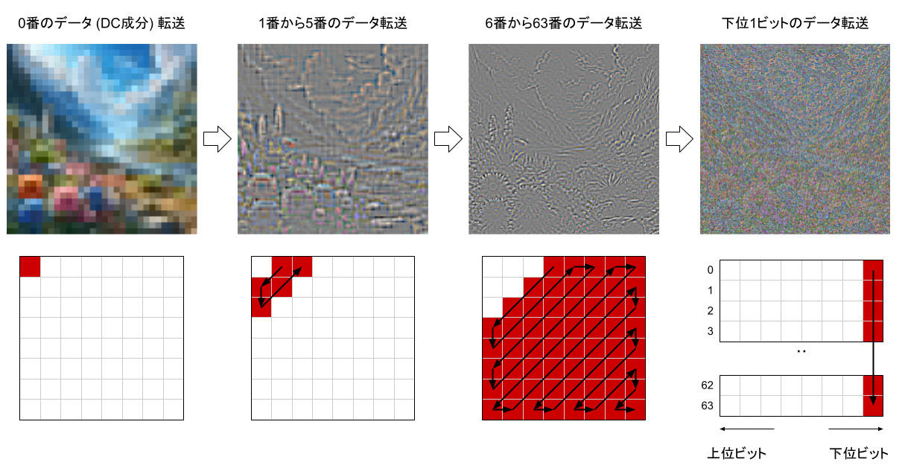

こちらの図は一例となり何をどのような順序で転送を行うかに関してはプログレッシブのデータ制御によります。

#### コンポーネント

各色の要素をJPEGではコンポーネントと呼びます。

#### スキャン

スキャンとはデータ転送における制御単位となります。
ベースラインでは単一のスキャンになり、プログレッシブではこれらのスキャンが複数あり複数回にわたり徐々にデータとしての細部を順次、このスキャン単位で制御しつつ転送していく形になります。

#### インターリーブ

一つのスキャンで複数の色情報を転送する方式になります。この際、色の間引きを行っている際、各コンポーネントのユニット数が一致しなくなるので後述する最小符号化単位 (MCU) により

##### 最小符号化単位 (MCU : Minimum Coded Unit)

JPEGでは画像の左上の処理単位から水平方向に右に向かって順々にデータを書き出し右端に到達したら1行下のデータを順々にデータを書き出し左下に到達したら書き出し終了となります。

[画像]

個別の色要素の画像を転送する非インターリーブあれば単純にユニット単位で転送を行えばよいのですが複数の色要素の画像を転送するインターリーブの場合で且つ色の間引きにより Y, Cb, Cr のサイズが異なる場合は転送順を考える必要があります。

[画像]

そこで導入される MCU (Minimum Coded Unit : 最小符号化単位) と呼ばれる仕組みとなります。これは複数のユニットを収納できる処理単位をMCUとして定義し解像度の異なる複数の色情報の転送順を工夫した仕様となります。

[画像]

#### 非インターリーブ

スキャンで転送されてくるコンポーネントが単一の場合は各コンポーネントのユニットのサイズを考慮する必要がなくなりしたがってMCUも使用する必要がなくなるのでユニット単位でのデータ転送になります。

#### 逐次近似 (Successive Approximation)

逐次近似では最初に上位ビットのデータを送り、後に残りの未転送の下位ビットの情報を1ビットずつ送る転送になります。

#### エントロピー符号化

JPEGではスキャンデータに対しハフマン符号化を周波数成分の1要素単位で掛けていきます。また周波数成分の係数で連続して0が続く場合はそれらに対し特殊なコードを与え読み込みをスキップする機能があります。

こちらのエントロピー符号化は直流成分と交流成分の2つのモードがあります。

##### ハフマン符号化

JPEGで標準的に使用されているエントロピー符号化となります。よく出現するコードには短いビット列をあまり出現しないコードには長いビット列を割り当てます。

実際の数値の処理は実装編にて解説します。

##### 算術符号化

こちらはJPEGの仕様で定義されているものの2002年頃に特許が執行したもののハフマン符号化が主流となり尚且つ計算コストが高くほとんど使用されていないので説明は省きます。


### ビットデータストリームの実装

JPEGのデータはセグメントのメタデータは基本的に16bit, 8bit単位で読み書きを行います。しかしエントロピー符号化されたデータに関してはデータ容量の効率を重視したものになりビット単位でのデータアクセスが求められます。

そこでデータ解析に先立ってJPEGのビットデータストリームの解説を行いたいと思います。

## JPEGのエンコード、デコードに必要なアルゴリズム

この章ではJPEGのエンコード、デコードに必要な基礎的なアルゴリズムの実装に関する解説を行います。また具体的なJPEGのデータ構造に根差したエンコード、デコードの処理方法に関しては次の章で解説を行います。

解説する項目としては色空間変換、画像分割、周波数解析、

### ハフマン符号化

### データの転送準

#### ベースライン

#### プログレッシブ

##### シーケンシャル

## JPEGのデータ構造

この章では前々章で解説したJPEGのエンコード、デコードに必要な基礎的なアルゴリズムの解説を元に、よりJPEGのデータ構造に根差したのエンコード、デコードに必要な具体的な構造や実装に言及した解説を行います。

### 基本的なデータ構造

### JPEGデコーダーの実装


#### ジグザグシーケンスユーティリティ


#### 周波数変換ユーティリティ

```JavaScript
/**
 * 8*8の正方行列の高速離散コサイン変換
 * 中身はJPEG用に調整したB.G.Lee型の高速DCTタイプII
 * @oaran n 正方行列の一辺の要素数
 * @param x n*nの正方行列
 */
export function dct(n, x = 8) { ... }

/**
 * 8*8正方行列の高速逆離散コサイン変換
 * 中身はJPEG用に調整したB.G.Lee型の高速DCTタイプIII
 * @oaran n 正方行列の一辺の要素数
 * @param x n*nの正方行列
 */
export function idct(n, x = 8) { ... }
```

#### データストリームクラス

```JavaScript
/**
 * JPEGのデータ読み込み用のデータストリームクラス
 */
export class JpegReadStream {

    /** コンストラクタ */
    constructor(buffer, offset = 0) {}
    
    /** ストリームのカーソル位置を取得する */
    get position() {}

    /** ストリームのカーソル位置を設定する */
    set position(position) {}

    /** 保存しているビット配列を取得する */
    get remainBits() {}

    /** 保存しているビット配列のビット数を取得する */
    get remainBitsCount() {}

    /** 内部に保存している未出力のビット配列を取得する */
    get remainBits() {}

    /** 内部に保存している未出力のビット配列のビット数を取得する */
    get remainBitsCount() {}

    /** ストリームを指定するbyte数スキップする */
    skip(size) {}

    /** 符号なしの8bitの整数を読み込む */
    readUint8() {}

    /** 符号なしの16bitの整数を読み込む */
    readUint16() {}

    /** マーカーを読み込む */
    readMaker() {}

    /** 符号なしの8bitの整数の配列を読み込む */
    readUint8Array(dst, off, len) {}

    /** 指定ビット数のデータを読み込む */
    readBits(num) {}

    /** 内部で未出力のビット配列のステータスをリセットする */
    resetRemainBits() {}
}
```

#### マーカー定義

```JavaScript
/**
 * JPEGのマーカーの定義をまとめたクラス
 */
export class JpegMarker {

    // フレームの開始マーカー、非差分、ハフマン符号化

    /** ベースラインDCT */
    static get SOF0() { return 0xFFC0; }

    /** 拡張シーケンシャルDCT */
    static get SOF1() { return 0xFFC1; }

    /** プログレッシブDCT */
    static get SOF2() { return 0xFFC2; }

    /** 可逆圧縮*/
    static get SOF3() { return 0xFFC3; }

    // フレームの開始マーカー、差分、ハフマン符号化

    /** 差分シーケンシャルDCT */
    static get SOF5() { return 0xFFC5; }

    /** 差分プログレッシブDCT */
    static get SOF6() { return 0xFFC6; }

    /** 差分可逆圧縮 (シーケンシャル) */
    static get SOF7() { return 0xFFC7; }

    // フレームの開始マーカー、非差分、算術符号化

    /** 予約済みのJPEG拡張 */
    static get JPG() { return 0xFFC8; }

    /** 拡張シーケンシャルDCT */
    static get SOF9() { return 0xFFC9; }

    /** プログレッシブDCT */
    static get SOF10() { return 0xFFCA; }

    /** 可逆圧縮 */
    static get SOF11() { return 0xFFCB; }

    // フレームの開始マーカー、差分、算術符号化

    /** 差分シーケンシャルDCT */
    static get SOF13() { return 0xFFCD; }

    /** 差分プログレッシブDCT */
    static get SOF14() {
        return 0xFFCE;
    }

    /** 差分可逆圧縮 */
    static get SOF15() {
        return 0xFFCF;
    }

    // ハフマンテーブルの仕様

    /** ハフマンテーブル */
    static get DHT() { return 0xFFC4; }

    // 算術符号化コンディショニングの仕様

    /** 算術符号化コンディショニングの定義 */
    static get DAC() {
        return 0xFFCC;
    }

    // リスタートインターバルの終端子

    /** リスタート */
    static get RSTn() { return 0xFFD0; }

    /** リスタート */
    static get RSTn_end() { return 0xFFD7; }

    // その他のマーカー

    /** 画像の開始 */
    static get SOI() {
        return 0xFFD8;
    }

    /** 画像の終了 */
    static get EOI() { return 0xFFD9; }

    /** スキャンの開始 */
    static get SOS() { return 0xFFDA; }

    /** 量子化テーブルの定義 */
    static get DQT() { return 0xFFDB; }

    /** ライン数の定義 */
    static get DNL() { return 0xFFDC; }

    /** リスタートインターバルの定義 */
    static get DRI() { return 0xFFDD; }

    /** 階層プログレスの定義 */
    static get DHP() { return 0xFFDE; }

    /** 伸張リファレンスの定義 */
    static get EXP() { return 0xFFDF; }

    /** 予約済みのアプリケーションセグメント */
    static get APPn() { return 0xFFE0; }

    /** 予約済みのアプリケーションセグメント */
    static get APPn_end() { return 0xFFEF; }

    /** 予約済みのJPEG拡張 */
    static get JPGn() { return 0xFFF0; }

    /** 予約済みのJPEG拡張 */
    static get JPGn_end() { return 0xFFFD; }

    /** コメント */
    static get COM() { return 0xFFFE; }

    // 予約済みマーカー

    /** 算術符号化で使用する一時的領域 */
    static get TEM() { return 0xFF01; }

    /** 予約済み */
    static get RESn() { return 0xFF02; }
}

```

### ジグザグシーケンス (Zig-zag sequence)

### サンプル精度 (Sample precision)

### マルチコンポーネントコントロール (Multiple-compoment consorol)

### インターリーブマルチコンポーネント (Interleaving multiple components)

### 最小コード単位 (MCU: Minimum coded unit)

### 直流成分差分エンコード (Differential DC encoding)

### ハイレベルシンタックス

#### スタートイメージマーカー (SOI)

#### エンドイメージマーカー (EOI)

#### リスターティング (RSTm)

### フレームヘッダーシンタックス

|パラメータ|サイズ (bit)|ベースライン|拡張シーケンシャル|プログレッシブ|説明|
|:--------|:----------|:--|:--|:--|:--|
|Lf|16|8 + 3 × Nf|〃|〃|フレームヘッダー長|
|P|8|8|8,12|8,12|サンプル精度 (ビット数)|
|Y|16|0～65535|〃|〃|ライン数 (縦のサイズ)|
|X|16|1～65535|〃|〃|ラインあたりのサンプル数 (横のサイズ)|
|Nf|8|1～255|1～255|1～4|フレームのコンポーネント数|
|C_i|8|0～255|〃|〃|コンポーネント識別子|
|H_i|4|1～4|〃|〃|水平方向のサンプリング|
|V_i|4|1～4|〃|〃|垂直方向のサンプリング|
|Tq_i|8|0～3|〃|〃|量子化テーブルセレクター|

### フレーム開始セグメント

### 


### スキャン開始セグメント

### 量子化テーブル定義セグメント

### ハフマンテーブル定義セグメント

### 算術符号化条件定義セグメント

### リスタートインターバルセグメント

### コメントセグメント

### アプリケーションデータセグメント

### ライン数定義セグメント

### 拡張リファレンスコンポーネントセグメント

### エンドマーカー

### 予約済み、未使用セグメント

#### SOFマーカー

- SOF3
  - ハフマン符号化を用いた可逆圧縮用のセグメント定義です。
- SOF9
  - 算術演算符号化を用いた非可逆圧縮形式で且つシーケンシャルDCTでのデーター転送に対応したセグメント定義です。算術演算符号化は仕様上、定義はされているものの特許の問題があるので未実装のセグメントとなります。
- SOF10
  - 算術演算符号化を用いた非可逆圧縮形式で且つプログレッシブDCTでのデーター転送に対応したセグメント定義です。算術演算符号化は仕様上、定義はされているものの特許の問題があるので未実装のセグメントとなります。
- SOF11
  - 算術演算符号化んを用いた可逆圧縮用のセグメントセグメント定義です。算術演算符号化は仕様上、定義はされているものの特許の問題があるので未実装のセグメントとなります。

## サンプルプログラム

## あとがき

JPEGの基本概念と実装の解説は如何でしたでしょうか？

筆者はJPEGの公式の仕様書を読みながらの実装は大変ではありましたが、そのノウハウをなるだけ分かりやすく解説に落とし込む作業の方が仕様の分量の関係上、凄く無謀な挑戦になってしまったと感じました。（笑）

日本語でもJPEGの解説を行っている記事やページは数多くありますが仕様を細かく解説されているものが、あまり見受けられなかったのは単純にJPEGの仕様の分量が多い事が起因して日本語の情報量が少ない事を原因を今回の記事の作成で痛感しました。

しかしながら、この記事を読んでくださった皆様が一人でも多くJPEGの仕様を全体的でも部分的にでも理解していただき信号処理や画像処理、画像圧縮などの分野に興味を持っていただけたのであれば幸いです。

## 参考

- [JPEG - Wikipedia](https://ja.wikipedia.org/wiki/JPEG)
- [ITU T.81](https://www.w3.org/Graphics/JPEG/itu-t81.pdf)
- [JPEG File Interchange Format Version 1.02](https://www.w3.org/Graphics/JPEG/jfif3.pdf)
- [離散コサイン変換 - Wikipedia](https://ja.wikipedia.org/wiki/%E9%9B%A2%E6%95%A3%E3%82%B3%E3%82%B5%E3%82%A4%E3%83%B3%E5%A4%89%E6%8F%9B)
- [A New Algorithm to Compute the
Discrete Cosine Transform - 
BYEONG GI LEE](https://www.nayuki.io/res/fast-discrete-cosine-transform-algorithms/lee-new-algo-discrete-cosine-transform.pdf)
